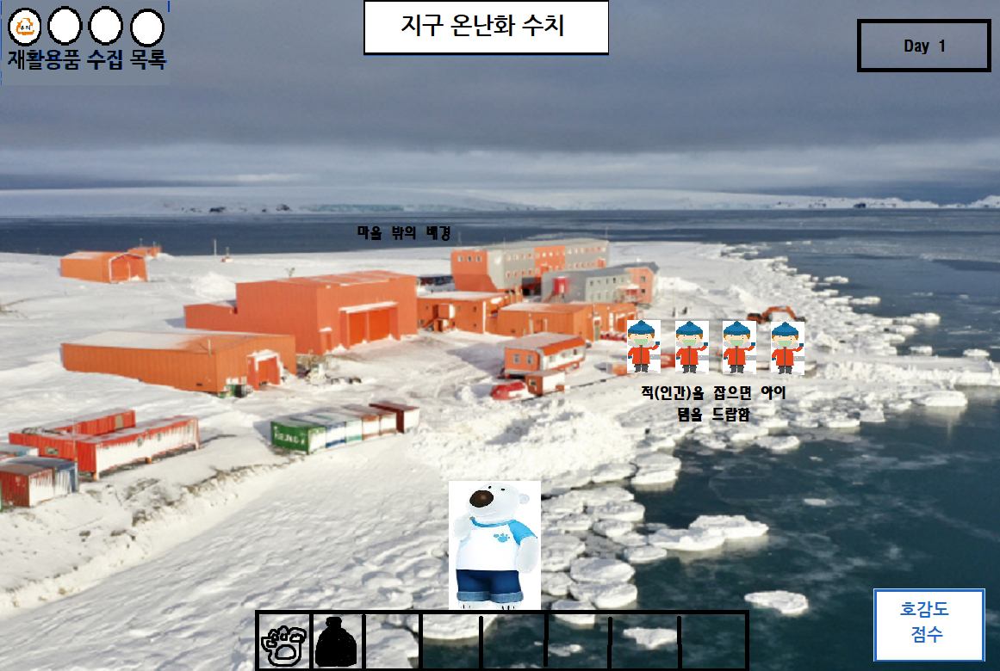
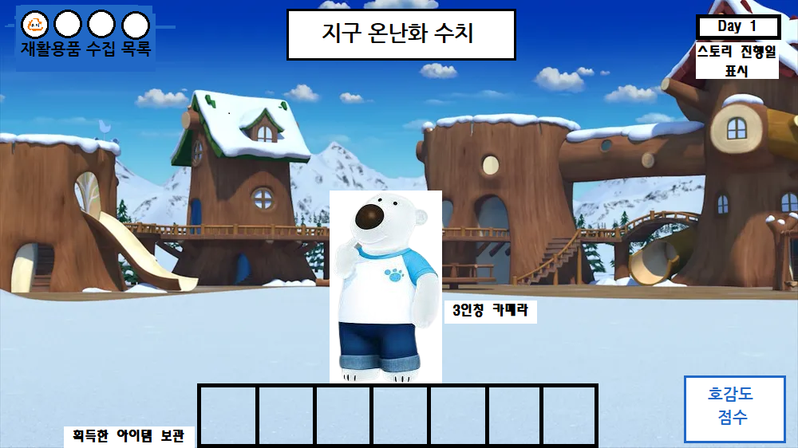

# 프로젝트명 : OVERCOME  
# [컨셉]  
## 메인컨셉 :

- 현재 지구가 처한 기후위기를 극복하기 위해 북극곰이 남극에 사는 펭귄들과 함께 과거 깨끗했던 지구의 환경으로 복구시키는 이야기

### 서브 컨셉 1 : 청소

- 인간들에 의해서 더렵혀진 환경을 청소함으로써 현재 처한 지구의 기후위기를 극복하는 과정
- 마을 바깥의 환경을 더럽히고 있는 인간을 플레이어가 공격하여 그들이 버리려는 쓰레기를 빼앗아 더이상 더럽히지 못하도록 함.
- 추가로 이미 더러워진 환경을 획득한 아이템을 통해 정화할 수 있음.
### 서브 컨셉 2 : 대화

- 플레이어가 마을의 NPC들과의 대화를 통해 마을의 사건들과 인간들을 막는 퀘스트를 진행할 수 있음.
- 상점의 NPC를 통해 플레이어가 획득한 재화를 사용하여 청소를 더 빨리 할 수 있는 아이템을 교환하거나, 인간을 막아낼 수 있는 아이템을 교환할 수 있음.
- 대화를 통해 전체적인 게임의 스토리를 파악하고, 이를 통해 환경보호의 중요성을 플레이어에게 느끼게 해줄 수 있을 것이라 기대됨.

### 서브 컨셉 3 : 주변 환경

- 스테이지를 진행할 수록 더러웠던 배경이 플레이어의 총소로 인해 다시 깨끗했던 남극으로 점차 바뀌어감.
- 스토리의 진행 상황을 이를 통해 대략적으로 알 수 있게 함.

### 서브 컨셉 4 : 간편한 조작, UI

- 마우스가 회전하는 방향으로 화면이 돌아가고 방향키를 눌러 플레이어의 이동과 공격, 또는 NPC와의 상호작용을 할 수 있음.
- 인벤토리와 진행 날짜, 획득한 재화만을 표시하여 한눈에 보기 편한 UI를 제공함.

### 서브 컨셉 5 : Low Poly 그래픽

- 게임 ‘동물의 숲’과 같은 아기자기한 그래픽을 사용하여 무거운 주제에 플레이어가 쉽게 다가갈 수 있도록 함.
    
 
# [관련 이미지 & 동영상]

- 이미지  
  
  
- 동영상
  

  
